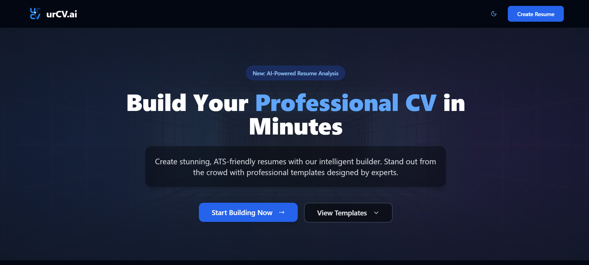
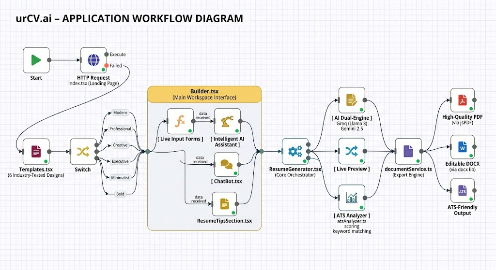
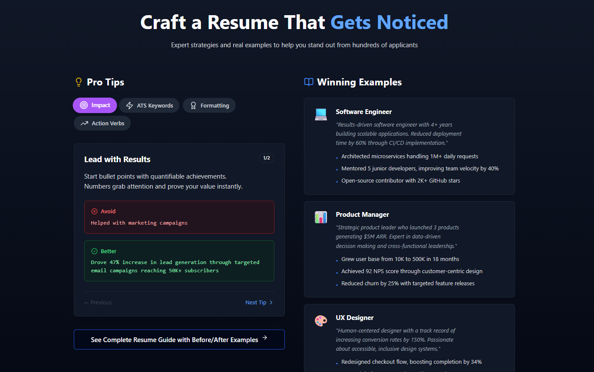
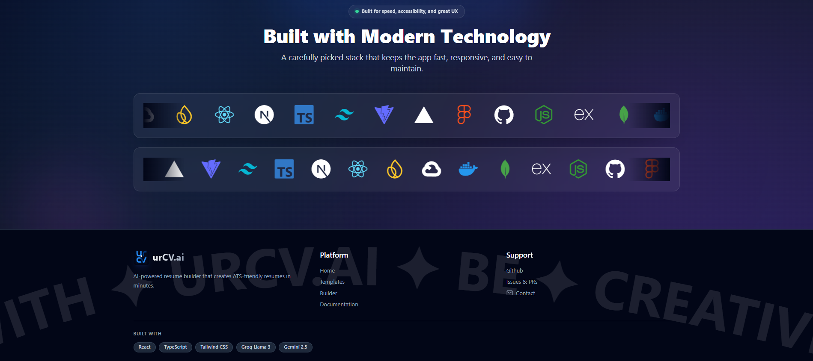
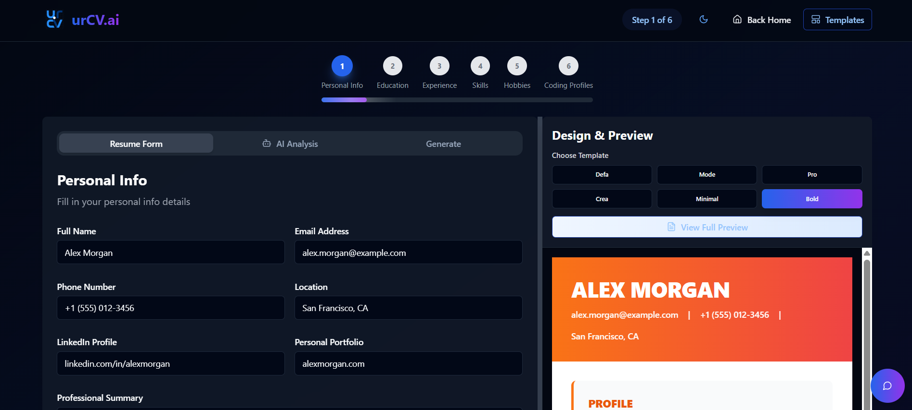
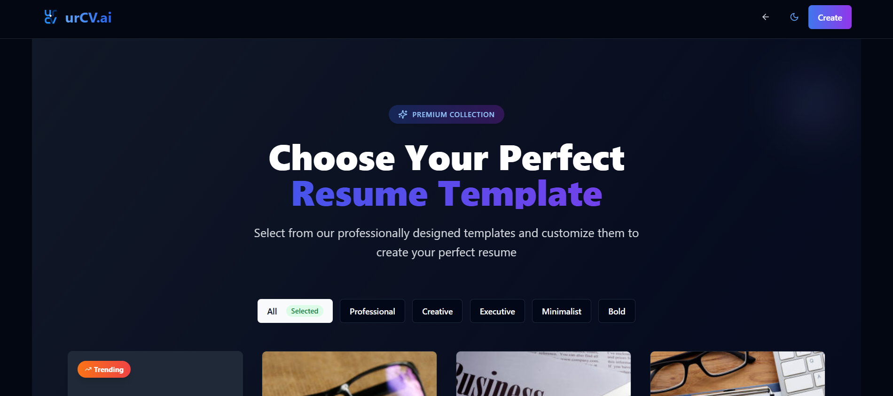

# 🚀 urCV.ai – Intelligent Resume Builder



<p align="center">
  <b>Build ATS-friendly resumes in minutes using AI.</b><br/>
  Powered by <b>Groq (Llama 3)</b> ⚡ + <b>Google Gemini 2.5</b> 🧠
</p>

<p align="center">
  <a href="#features"><strong>Explore Features</strong></a> •
  <a href="#getting-started"><strong>Quick Start</strong></a> •
  <a href="#templates"><strong>View Templates</strong></a> •
  <a href="#deployment"><strong>Deploy</strong></a>
</p>

---

## ✨ Overview

**urCV.ai** is a cutting-edge, AI-powered resume builder designed to revolutionize how job seekers create **professional, ATS-optimized resumes**. Built with modern web technologies and powered by advanced AI models, it delivers an unparalleled resume-building experience that helps you land your dream job.

### Workflow Diagram


### 🧠 Dual-Engine AI Architecture

- ⚡ **Groq (Llama 3)** → Lightning-fast resume analysis, scoring, and keyword optimization
- 🤖 **Google Gemini 2.5** → Intelligent content rewriting, career guidance, and personalized suggestions

### 🎯 What Makes urCV.ai Different

- **Smart AI Assistant**: Context-aware chatbot that helps you craft perfect resumes
- **Real-time Analysis**: Instant ATS scoring and improvement recommendations
- **Professional Templates**: 6 stunning, industry-tested resume designs
- **Multi-format Export**: PDF, DOCX, and ATS-friendly outputs
- **Modern UI/UX**: Beautiful, responsive interface with smooth animations
- **Comprehensive Guide**: Built-in resume writing tips and best practices

---

## 🚀 Features

### 🤖 AI-Powered Resume Intelligence

- **Instant Resume Scoring**: Get your resume scored against ATS standards in real-time
- **Keyword Analysis**: Identify missing keywords and optimize for specific job descriptions
- **Smart Content Rewriting**: AI-powered bullet point enhancement and professional phrasing
- **Career Guidance**: Personalized advice tailored to your career path and industry
- **Contextual Chatbot**: Ask questions and get instant resume-building help from our AI assistant

### 🎨 Professional Resume Templates

- **Modern**: Clean, contemporary design perfect for tech and creative roles
- **Professional**: Traditional format ideal for corporate and business positions
- **Creative**: Eye-catching layout for designers, artists, and creative professionals
- **Executive**: Sophisticated design for senior-level and C-suite positions
- **Minimalist**: Simple, elegant format that focuses purely on content
- **Bold**: Confident design that makes a strong first impression

### 🛠️ Advanced Builder Features

- **Live Preview**: Real-time resume preview as you type
- **Split-screen Editing**: Edit and preview simultaneously for efficiency
- **Form-based Input**: Structured forms for education, experience, skills, and more
- **Coding Profiles**: Dedicated section for GitHub, LinkedIn, and portfolio links
- **Hobbies & Interests**: Add personality with customizable hobby sections
- **Full Preview Modal**: Detailed full-screen preview before export

### 📱 Modern User Experience

- **Responsive Design**: Optimized for desktop, tablet, and mobile devices
- **Dark/Light Theme**: Toggle between themes for comfortable viewing at any time
- **Smooth Animations**: Beautiful transitions and micro-interactions throughout
- **Loading States**: Professional loading screens and progress indicators
- **Toast Notifications**: Non-intrusive feedback for user actions

### ⬇️ Export & Sharing

- **High-Quality PDF**: Crystal-clear PDF export with perfect formatting
- **Editable DOCX**: Microsoft Word compatible documents for further editing
- **ATS-Friendly**: Optimized for Applicant Tracking Systems used by recruiters
- **Print-Ready**: Professional print quality output

---
## 📸 Screenshots

### 🌟 Landing Page


### 🛠️ Resume Guides



### 🎨 Tech Stack



### 👔 Bold Template Preview



### 🎯 Template Selection



---

## 🛠️ Tech Stack

### 🎨 Frontend Framework

- ⚛️ **React 18** with **Vite** for lightning-fast development
- 🟦 **TypeScript** for type-safe development
- 💨 **Tailwind CSS** for utility-first styling
- 🧱 **Shadcn/UI** for beautiful, accessible components
- 🎯 **Lucide React** for consistent iconography
- 🌊 **Framer Motion** for smooth animations

### 🧠 AI & Machine Learning

- ⚡ **Groq SDK** (Llama 3) for ultra-fast AI processing
- 🤖 **Google Generative AI SDK** (Gemini 2.5) for intelligent content generation
- 🧠 Advanced prompt engineering for optimal resume analysis

### 📄 Document Processing

- 📂 **mammoth** for Word document parsing
- 📄 **jsPDF** for PDF generation
- 📝 **docx** for Word document export
- 🖼️ **html2canvas** for high-quality image capture

### 🎭 UI/UX Enhancements

- 🌓 **next-themes** for dark/light mode switching
- 🎨 **Radix UI** components for accessibility
- 📊 **TanStack React Query** for efficient state management
- 🔔 **Sonner** for elegant toast notifications
- 📱 **React Router** for seamless navigation

### 🛠️ Development Tools

- 📏 **ESLint** for code quality
- 🎯 **PostCSS** for CSS processing
- 📦 **Vite** for optimized bundling
- 🔧 **React Hook Form** for form management

---

## 🏁 Getting Started

### 🔧 Prerequisites

Before you begin, ensure you have the following installed:

- **Node.js** v18+ and npm/yarn/bun
- **Git** for version control
- A **Google Gemini API key** (required)
- A **Groq API key** (optional, for enhanced features)

### 🚀 Quick Start

#### 1️⃣ Clone the Repository

```bash
git clone https://github.com/N-PCs/urCV.ai.git
cd urCV.ai
```

#### 2️⃣ Install Dependencies

```bash
npm install
# or
yarn install
# or
bun install
```

#### 3️⃣ Environment Setup

Create a `.env` file in the root directory with your API keys:

```env
# Required: Google Gemini API Key
VITE_GEMINI_API_KEY=your_gemini_api_key_here

# Optional: Groq API Key (for enhanced AI features)
VITE_GROQ_API_KEY=your_groq_api_key_here
```

**Getting API Keys:**
- **Gemini API**: Get your free API key from [Google AI Studio](https://makersuite.google.com/app/apikey)
- **Groq API**: Sign up at [Groq Console](https://console.groq.com/)

#### 4️⃣ Start Development Server

```bash
npm run dev
# or
yarn dev
# or
bun dev
```

🌐 **Open [http://localhost:5173](http://localhost:5173) in your browser**

### 📦 Available Scripts

```bash
npm run dev          # Start development server
npm run build        # Build for production
npm run build:dev    # Build in development mode
npm run preview      # Preview production build
npm run lint         # Run ESLint
```

---

## 🌐 Deployment

### 🚀 Deploy to Vercel (Recommended)

1. **Push to GitHub**:
   ```bash
   git add .
   git commit -m "Initial commit"
   git push origin main
   ```

2. **Deploy on Vercel**:
   - Visit [vercel.com/new](https://vercel.com/new)
   - Import your GitHub repository
   - Configure the following:
     - **Framework Preset**: Vite
     - **Root Directory**: `./`
     - **Build Command**: `npm run build`
     - **Output Directory**: `dist`
   - Add **Environment Variables**:
     - `VITE_GEMINI_API_KEY`: Your Gemini API key
     - `VITE_GROQ_API_KEY`: Your Groq API key (optional)
   - Click **Deploy** 🚀

### 🐳 Docker Deployment

Create a `Dockerfile` in the root directory:

```dockerfile
FROM node:18-alpine

WORKDIR /app

# Copy package files
COPY package*.json ./

# Install dependencies
RUN npm ci --only=production

# Copy source code
COPY . .

# Build the application
RUN npm run build

# Expose port
EXPOSE 3000

# Start the application
CMD ["npm", "run", "preview"]
```

Build and run:

```bash
docker build -t urcv-ai .
docker run -p 3000:3000 urcv-ai
```

### 📂 Project Structure

```text
urCV.ai/
├── 📁 public/                     # Static assets & images
│   ├── Resume1-6.jpg             # Resume sample images
│   ├── favicon*                  # Favicon files
│   └── *.png                     # Logo and brand assets
├── 📁 docs/
│   └── 📁 images/                # Documentation screenshots
├── 📁 src/
│   ├── 📁 components/
│   │   ├── 📁 layout/            # Header, Footer components
│   │   ├── 📁 resume/            # Resume builder components
│   │   │   ├── ChatBot.tsx       # Gemini AI assistant
│   │   │   ├── ResumeAnalysis.tsx    # ATS analysis
│   │   │   ├── ResumeGenerator.tsx   # Main builder
│   │   │   ├── ResumePreview.tsx     # Live preview
│   │   │   ├── ResumeTipsSection.tsx # Writing tips
│   │   │   ├── 📁 templates/     # 6 Resume templates
│   │   │   └── 📁 forms/         # Input forms
│   │   ├── 📁 ui/                # Shadcn UI components
│   │   ├── GridScan.tsx          # Animated background
│   │   ├── LogoLoop.tsx          # Logo animation
│   │   └── ThemeToggle.tsx       # Dark/Light mode
│   ├── 📁 pages/                 # Application routes
│   │   ├── Index.tsx             # Landing page
│   │   ├── Builder.tsx           # Main resume builder
│   │   ├── Templates.tsx         # Template gallery
│   │   ├── CodingPrep.tsx        # Coding preparation
│   │   ├── InterviewQuestions.tsx # Interview guide
│   │   └── ResumeGuide.tsx       # Resume writing guide
│   ├── 📁 services/              # AI & document services
│   │   ├── chatService.ts        # Chatbot integration
│   │   ├── groqService.ts        # Groq AI service
│   │   ├── documentService.ts    # PDF/DOCX export
│   │   └── fileParserService.ts  # File parsing
│   ├── 📁 lib/                   # Utility functions
│   │   ├── atsAnalyzer.ts        # ATS scoring logic
│   │   ├── validations.ts        # Form validations
│   │   └── utils.ts              # Helper functions
│   ├── 📁 hooks/                 # Custom React hooks
│   ├── 📁 context/               # React context providers
│   ├── App.tsx                   # Main app component
│   └── main.tsx                  # App entry point
├── 📄 package.json               # Dependencies & scripts
├── 📄 tailwind.config.ts         # Tailwind configuration
├── 📄 tsconfig.json              # TypeScript configuration
├── 📄 vite.config.ts             # Vite build configuration
└── 📄 README.md                  # This file
```

---

## 🤝 Contributing

✨ **Contributions are highly welcome and appreciated!**

We believe in the power of community collaboration. Whether you're fixing bugs, improving the UI, optimizing AI prompts, enhancing documentation, or suggesting new features — every contribution matters! 🚀

### 🎯 How You Can Contribute

- 🐛 **Bug Reports**: Found an issue? Please open an issue with a detailed description
- 💡 **Feature Requests**: Have an idea? We'd love to hear it!
- 📝 **Documentation**: Help us improve the README and code comments
- 🎨 **UI/UX**: Design improvements and accessibility enhancements
- 🧠 **AI Prompts**: Optimize our AI prompts for better results
- 🧪 **Testing**: Add tests and improve code coverage
- 🌍 **Translations**: Help make urCV.ai accessible to more people

### 🛠️ Contributing Guidelines

#### 1️⃣ Fork the Repository

Click the "Fork" button at the top right of this page.

#### 2️⃣ Clone Your Fork

```bash
git clone https://github.com/YOUR_USERNAME/urCV.ai.git
cd urCV.ai
```

#### 3️⃣ Create a Feature Branch

```bash
git checkout -b feature/your-amazing-feature
# or
git checkout -b fix/your-bug-fix
```

#### 4️⃣ Make Your Changes

- Follow the existing code style and conventions
- Add comments for complex logic
- Test your changes thoroughly
- Ensure your code passes ESLint checks: `npm run lint`

#### 5️⃣ Commit Your Changes

Follow [Conventional Commits](https://www.conventionalcommits.org/) specification:

```bash
git commit -m "feat: add your amazing feature"
git commit -m "fix: resolve the issue"
git commit -m "docs: update documentation"
```

#### 6️⃣ Push to Your Fork

```bash
git push origin feature/your-amazing-feature
```

#### 7️⃣ Open a Pull Request 🚀

- Go to the [original repository](https://github.com/N-PCs/urCV.ai)
- Click "New Pull Request"
- Provide a clear description of your changes
- Link any relevant issues
- Include screenshots if applicable (especially for UI changes)

---

## 📄 License

```text
MIT License

Copyright (c) 2026 N-PCs

Permission is hereby granted, free of charge, to any person obtaining a copy
of this software and associated documentation files (the "Software"), to deal
in the Software without restriction, including without limitation the rights
to use, copy, modify, merge, publish, distribute, sublicense, and/or sell
copies of the Software, and to permit persons to whom the Software is
furnished to do so, subject to the following conditions:

The above copyright notice and this permission notice shall be included in all
copies or substantial portions of the Software.

THE SOFTWARE IS PROVIDED "AS IS", WITHOUT WARRANTY OF ANY KIND, EXPRESS OR
IMPLIED, INCLUDING BUT NOT LIMITED TO THE WARRANTIES OF MERCHANTABILITY,
FITNESS FOR A PARTICULAR PURPOSE AND NONINFRINGEMENT. IN NO EVENT SHALL THE
AUTHORS OR COPYRIGHT HOLDERS BE LIABLE FOR ANY CLAIM, DAMAGES OR OTHER
LIABILITY, WHETHER IN AN ACTION OF CONTRACT, TORT OR OTHERWISE, ARISING FROM,
OUT OF OR IN CONNECTION WITH THE SOFTWARE OR THE USE OR OTHER DEALINGS IN THE
SOFTWARE.
```

📜 **This project is developed under the AcWoc 2026 Initiative.**

---

## 🙏 Acknowledgments

We extend our gratitude to the following projects and organizations that made urCV.ai possible:

- **[Groq](https://groq.com/)** for providing ultra-fast AI inference
- **[Google](https://ai.google.dev/)** for the powerful Gemini AI models
- **[Vercel](https://vercel.com/)** for excellent hosting platform
- **[Shadcn/UI](https://ui.shadcn.com/)** for beautiful component library
- **[Radix UI](https://www.radix-ui.com/)** for accessible primitives
- **[Tailwind CSS](https://tailwindcss.com/)** for utility-first CSS framework
- The open-source community for amazing tools and libraries

---

## 📞 Support & Community

- 🐛 **Bug Reports**: [Open an issue](https://github.com/N-PCs/urCV.ai/issues)
- 💡 **Feature Requests**: [Start a discussion](https://github.com/N-PCs/urCV.ai/discussions)
- 📧 **Contact**: [Neel Pandey](https://github.com/N-PCs)
- 🌐 **Live Demo**: [urcvai.vercel.app](https://urcvai.vercel.app/)

---

<div align="center">
  <p>🧠 <strong>Maintained with ❤️ by <a href="https://github.com/N-PCs">N-PCs</a></strong></p>
  <p>If you find this project helpful, please consider giving it a ⭐️ on GitHub!</p>
  <p>
    <a href="#-urcvai--intelligent-resume-builder">⬆️ Back to Top</a> •
    <a href="https://github.com/N-PCs/urCV.ai">📂 View on GitHub</a> •
    <a href="https://urcvai.vercel.app/">🌐 Live Demo</a>
  </p>
</div>
